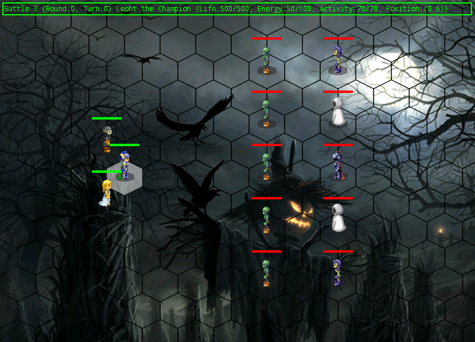

#SRPG Demo

This is an example of Strategy Role-Playing Game Programming, for android only.

##Main Features

* Round based battle, use unique abilities to beat enemy.
* Hexagon-tiled map, with A* pathfinding support.
* Contextual game control - click a gird to take action, while casting some ability, click and hold the icon to show help.
* Spell effects: chain lightning, magic missle, and more.
* Very simple AI.
* Xml formatted game data, support referencing and auto-unmarshelling.
* Pure android-java, no dependent framework or lib.
* Playable, 3 levels, 8 PC and NPCs, 20+ abilites.

##Battle Rules

* Life - when one of your characters' life go down 0, you lose.
* Energy - you need energy to use abilities, 10 energy per round regenerated for all you characters, basic attack cost no energy.
* Activity - you cost 10 activity per gird while your character move (more activity needed to pass a gird with corpses), and you cost all activity left to cast an ability, when activity go down 0, turn ends.
* Beat all enemy of the level, you win.